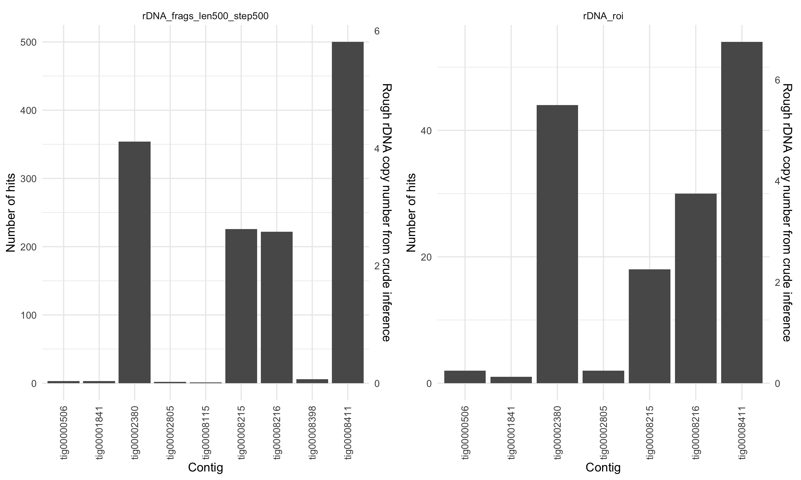
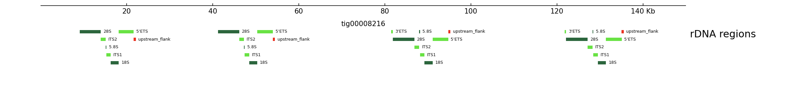
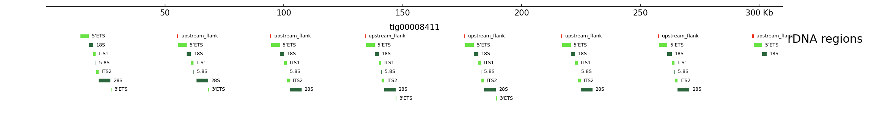

# rDNA clusters in the NA12878 consortium human genome assembly

Version: 0.0.9000 (19 May 2020)  
Author: Maurits Evers (maurits.evers@gmail.com)

## Workflow

The current workflow performs the following steps:

1. Build a `bowtie2` index from the NA12878 assembly.
2. Based on the U13369.1 rDNA reference sequence, align 500 bp long rDNA
fragments and sequences based on rDNA regions of interested to the NA12878
assembly. Store results as sorted & indexed BAM and BED files. Regions of
interest (ROI) include the transcribed regions 5'ETS, 18S, ITS1, 5.8S, ITS2,
28S and 3'ETS, as well as a 500 bp wide region upstream of the 5'ETS (which
includes the core promoter and upstream control elements).
3. Plot the number of fragment hits across the assembly's contigs.
    

4. Determine the loci where the first 500 bp rDNA fragment (or 5'ETS sequence)
maps to; these loci define the 5' start of an rDNA unit in the assembly; the 3'
end is defined as the 5' start of the next rDNA unit. If it is the last rDNA
unit in a cluster the 3' end is given by 5' start coordinate plus the average
length of the preceding rDNA units. This information defines a list of putative
rDNA loci in the assembly. We use this list to extract the corresponding
full rDNA unit sequences from the assembly.
    

5. From the rDNA ROI alignment, for every ROI extract a list with identified
matches and their corresponding sequences.  

5. Perform a multiple sequence alignment of the putative full rDNA sequences
and rDNA ROI sequences using `Clustal Omega` and visualise results using
`MView`.

6. Show hits of transcribed rDNA regions across the assembly's contigs using
`pygenometracks`.
    
    
    
    

The current workflow consists of separate shell and R scripts in the individual
main folders; for example `01_bowtie2_ref` has a shell script
[`do_indexing.sh`](01_bowtie2_ref/do_indexing.sh) that builds the `bowtie2`
index. A future version of the workflow will automate and robustify processes
using `snakemake`.


## Requirements and dependencies

### Data

- The NA12828 reference assembly FASTA file, stored in
`00_ref_sequences/assembly/albacore_canu_wtdbg_nanopolish2.fasta`.
- The U13369.1 human rDNA sequence as a FASTA file, stored in
`00_ref_sequences/rDNA_GenBank/U13369.1.fa`.
- Gzip'ed FASTA file of the fragmented rDNA in
`02_rDNA_frags/rDNA_frags_len500_step500.fa.gz` (see below).
- Annotation file of the transcribed regions in the U13369.1 rDNA sequence as
a BED file in `02_rDNA_frags/U13369.1_transcribed.bed`.

### Software

- [bedtools](https://bedtools.readthedocs.io/en/latest/); tested with
`bedtools_2.26.0`
- [bowtie2](http://bowtie-bio.sourceforge.net/bowtie2/index.shtml); tested with
`bowtie2_2.3.5.1`
- [Clustal Omega](https://www.ebi.ac.uk/Tools/msa/clustalo/); tested with
`clustalo_1.2.4`
- [deepTools](https://deeptools.readthedocs.io/en/develop/); tested with
`deeptools_3.4.3`
- [MView](https://desmid.github.io/mview/); tested with `mview_1.67`
- [pygenometracks](https://github.com/deeptools/pyGenomeTracks); tested with
`pgt_3.3`
- [R](https://www.r-project.org/) and R/Bioconductor libraries `Biostrings`,
`gridExtra`, `Rsamtools`, `tidyverse`; tested with `R_3.6.1`,
`Biostrings_2.52.0`, `gridExtra_2.3`, `Rsamtools_2.0.3`, `tidyverse_1.3.0`
- [samtools](http://www.htslib.org/); tested with `samtools_1.9`


## The NA12878 reference assembly

The reference genome is based on the de-novo assembly of the NA12878 consortium
data from the MinION (Oxford Nanopore Technology) nanopore sequencer. Full
details involving the sophisticated data analysis and assembly process can be
found

- in the original publication by [Jain et al., Nanopore sequencing and assembly of a human genome with ultra-long reads, Nature Biotechnology 36, 338 (2018)](https://www.nature.com/articles/nbt.4060),
- in [Human genome assemblies with nanopore, an update](https://genomeinformatics.github.io/na12878update/) from the Genome Informatics Section, and
- on the [Whole Human Genome Sequencing Project GitHub project page](https://github.com/nanopore-wgs-consortium/NA12878/blob/master/Genome.md).

The FASTA file of the Canu 1.7 + WTDBG + Nanopolish reference assembly is
available from the Center for Bioinformatics and Computational Biology at the
University of Maryland.

Further details and references:

- The assembly consists of 1172 contigs; contig sizes are summarised in the
following statistics
    ```r
    #Min.  1st Qu.   Median     Mean  3rd Qu.     Max.
    #1006    31736   244367  2405237  1951710 51216920
    ```
	
- [Koren et al., Canu: scalable and accurate long-read assembly via adaptive k-mer weighting and repeat separation, Genome Research 27, 722 (2017)](https://genome.cshlp.org/content/27/5/722); latest release: [Canu v2.0](https://github.com/marbl/canu/releases)
- [WTDBG: A fuzzy Bruijn graph approach to long noisy reads assembly](https://github.com/ruanjue/wtdbg); [Jue Ruan and Heng Li, Fast and accurate long-read assembly with wtdbg2, Nature Methods 17, 155 (202)](https://www.nature.com/articles/s41592-019-0669-3); latest release: [wtdbg2.5](https://github.com/ruanjue/wtdbg2); requires 1TB+ RAM
- [Nanopolish](https://github.com/jts/nanopolish) by Jared Simpson et al. is a
    > [s]oftware package for signal-level analysis of Oxford Nanopore sequencing data. Nanopolish can calculate an improved consensus sequence for a draft genome assembly, detect base modifications, call SNPs and indels with respect to a reference genome and more.


## Human ribosomal DNA sequence

We use the human ribosomal DNA complete repeating unit
[U13369.1](https://www.ncbi.nlm.nih.gov/nuccore/555853)
and fragment the sequence into 500 bp long non-overlapping subsequences. The
workflow does not generate these files, and instead requires these files to be
already present; they are generated as part of the publicly available
`snakemake`-based workflow
[frag_align_rDNA](https://github.com/mevers/frag_align_rDNA).


## TODO

1. Move workflow to `snakemake`


## The NA12878 consortium

The consortium includes

- Heng Li (Harvard Medical School and Dana-Farber Cancer Institute, former Broad Institute, developed samtools, bwa) [RNA]
- George Church (Harvard Medical School) [RNA]
- Matthew Loose (DeepSeq, University of Nottingham) [DNA]
- Nick Loman (Institute of Microbiology and Infection, University of Birmingham) [DNA]
- Jared Simpson (Ontario Institute for Cancer Research) [DNA]
- Alan Phillippy (Head of the Genome Informatics Section, University of Maryland) [DNA]

## Copyright and licence

The workflow is distributed under the GNU GPL licence version 3. The workflow contains the [MView](https://desmid.github.io/mview) source code as a `.tar.gz` file, which is distributed under the GNU GPL license version version 2 or higher.

The [NA12878 data is released under the Create Commons CC-BY licence](https://github.com/nanopore-wgs-consortium/NA12878/blob/master/Genome.md#data-reuse-and-license).
